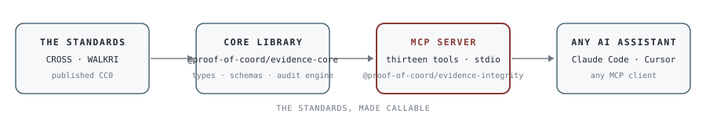

# CROSS+WALKRI Tools

The grants standards as callable AI tools: a typed core library and an MCP server that put CROSS and WALKRI inside Claude Code, Cursor, and any MCP-compatible assistant.

CROSS (Common Reporting Outcome Standards Schema) specifies the obligation architecture of a funding round: what grantees must demonstrate at each payment gate, in one of three obligation modes (build a deliverable, produce a measurable change, or recognize past contribution). WALKRI (Working Architecture for Legible, Knowable, Reliable Instrumentation) specifies the quality of the intake fields that collect that demonstration: every field carries a written criterion intent, an operational definition with qualifying and non-qualifying examples, a justified response type, a specified evidence artifact and access path, and a conformance threshold where external standards are referenced. Both are published CC0 at [github.com/CrossWalkri](https://github.com/CrossWalkri).

<p align="center">
<picture>
  <source media="(prefers-color-scheme: dark)" srcset="images/tools-flow-0_1_0-dark.svg">
  
</picture>
</p>

## Quick start

Clone this repo and point your MCP client at `server.mjs` in the root. No build step, no package manager.

```json
{
  "mcpServers": {
    "evidence-integrity": {
      "command": "node",
      "args": ["/path/to/cross-walkri-tools/server.mjs"]
    }
  }
}
```

Claude Code reads this from `~/.claude/settings.json`; Cursor from `.cursor/mcp.json`. Any stdio-transport MCP client works.

<details>
<summary>Alternative: install from JSR</summary>

Both packages are published on JSR at [jsr.io/@proof-of-coord](https://jsr.io/@proof-of-coord). The install names are compressed because the registry caps both halves of a package name at twenty characters; the full names appear throughout this document and in what the server reports.

```bash
npx jsr add @proof-of-coord/evidence-integrity
```

```json
{
  "mcpServers": {
    "evidence-integrity": {
      "command": "npx",
      "args": ["jsr", "run", "@proof-of-coord/evidence-integrity"]
    }
  }
}
```

For the core library alone: `npx jsr add @proof-of-coord/evidence-core`.

</details>

## The thirteen tools

| Tool | What it does | Reach for it when |
|---|---|---|
| `walkri_audit_field` | Audits a field against WALKRI's five requirements; returns per-criterion gaps and a binary verdict: instrument or label | Before any application form goes live; a label cannot be fixed retroactively |
| `walkri_generate_field` | Generates a WALKRI-conformant field specification from a plain-language description | Designing a form from scratch |
| `cross_check_gate` | Returns the full requirements for a CROSS gate by type and obligation mode; optionally audits supplied gate content | Configuring or reviewing a payment gate |
| `cross_configure_round` | Infers an obligation mode from a program description and recommends a validated gate structure | Setting up a round |
| `cross_classify_framework` | Classifies an external framework against the 146 CROSS+WALKRI primitives across seven layers | Mapping a new framework into the compatibility corpus |
| `cross_lookup_lens` | Looks up the five cross-cutting lenses (calibration tier, authority source, cultural-methodological lineage, funder typology, framework scope) | Placing a framework or funder in context |
| `cross_falsifiability_audit` | Applies the four-element falsifiability test, with the five gate-based types and eight failure modes | Testing whether a claim can actually be checked |
| `cross_audit_round` | Evaluates whether a described round was run correctly under CROSS+WALKRI; verdict plus prioritized gaps | Post-round review, or due diligence on someone else's round |
| `ore_grade_source` | Builds the ORE grading scaffold for a source: four dimensions, what must be recorded on each, the named gaps an account leaves open, opacity and monitoring obligations | Before admitting any source into a system that decides from it |
| `ore_check_independence` | Walks an evidence set for shared origin; flags restatements, uncited items and declared relationships, and counts origins claimed against origins established | Whenever sources agree and that agreement is about to carry weight |
| `ore_audit_finding` | Audits a finding against the five obligations of the finding contract, with observed evidence, gaps, fixes and systemic patterns | Before publishing a finding, or on someone else's |
| `ore_declare_posture` | Returns the three intake postures with downstream conditions, cautions, and the declaration requirements a conformant system must satisfy | Once per system before ingestion, and again when intake changes |
| `ore_run_benchmark` | The Meridian Basin dossier: twelve fabricated sources with known ground truth, four seeded failures and one control. Modes: case, key, score | Testing whether a pipeline catches evidence-integrity failures without over-flagging |

<details>
<summary>Full tool reference</summary>

**walkri_audit_field.** Audits a grant application field against WALKRI's five pre-publication requirements. Returns a per-criterion assessment (pass/fail with gap and fix suggestion) and a binary verdict: `instrument` (all five pass) or `label` (any fail). Also returns systemic patterns across failing criteria and a prompt template for revising the field with a language model. Use before publishing any application form; a field that goes live as a label cannot be fixed retroactively.

**walkri_generate_field.** Generates a WALKRI-conformant field specification from a plain-language description of what you want to measure. Returns a draft structural audit and a fully-formed prompt template ready to pass to a language model to produce the complete specification.

**cross_check_gate.** Returns the complete list of requirements for a CROSS gate of a given type (entry-specification, completion, continuation) operating in a given obligation mode (build, change, retroactive). Optionally accepts the gate content to run against the requirements and identify what is missing.

**cross_configure_round.** Accepts a plain-language program description and infers an obligation mode, then recommends a gate structure with evidence scope and evidence strength, validates the configuration for internal consistency, and returns a fully-formed prompt template for generating the complete configuration with a language model.

**cross_classify_framework.** Accepts a description of an external framework and classifies it against the 146 CROSS+WALKRI primitives across seven layers. Returns which layers the framework addresses, which primitives it exemplifies, which are absent, and a prompt template for generating a formal compatibility statement.

**cross_lookup_lens.** Looks up a dimension of the CROSS+WALKRI Lenses Framework. Five lenses sit above the primitives as cross-cutting metadata: calibration-tier (five tiers from impressionistic to falsifiable, with current-plus-target output shape), authority-source (where binding force comes from), cultural-methodological-lineage (the tradition the framework descends from, including Western institutional, Islamic finance jurisprudence, Indigenous Treaty partnership, Indigenous-led participatory non-Treaty, traditional without administrative infrastructure, and hybrid), funder-typology (ten kinds of funder including bilateral aid agency, multilateral bank or fund, private foundation, government non-aid, pooled fund, individual donor, DAO or protocol, corporate CSR, faith-based, and settlement-administered), and framework-scope-type (what kind of object the framework is). Returns the lens, its enumerated values, and detection criteria.

**cross_falsifiability_audit.** Applies the four-element falsifiability test from the Falsifiability Architecture document. A falsifiable claim has a pre-committed claim, a named verifying source outside the claimant's control, a drift detection mechanism, and a disclosure obligation. Returns the four structural elements with structural tests, the five gate-based falsifiability types (entry-gate, progress-gate, completion-gate, continuation-gate, portfolio-level), and the eight failure modes (transcendence-claim, declaration-exploit, precision-facade, partial-instantiation, direction-without-destination, vocabulary-without-architecture, correct-map-wrong-territory, frozen-map).

**cross_audit_round.** Evaluates whether a described grant round was run correctly under CROSS+WALKRI. Checks for entry specification gate, explicit obligation mode, completion gate, WALKRI-conformant field characteristics, and financial accountability. Returns a conformance verdict (conformant/partial/non-conformant) and a prioritized gap list, plus a prompt template for comprehensive AI-assisted evaluation.


**ore_grade_source.** Builds the grading scaffold for a data source at the ingestion boundary: the four ORE dimensions with the question each answers, what a conformant grading must record on each, the constraints that are easy to violate, and the named gaps the supplied account already leaves open. Also returns candidate cells of the confirmation-architecture table, the opacity obligations, and the monitoring obligation that keeps a grade from being a verdict. It does not return a grade, because ORE does not specify how any dimension is computed.

**ore_check_independence.** Walks an evidence set for shared origin. Returns the chain structure each item needs with every rung to be labeled for what it is, flags for items that state no basis, items that name another item in the set, and items declaring a relationship to an interested party, and reports origins claimed against origins established. Agreement is evidence only when the agreeing sources are distinct in origin.

**ore_audit_finding.** Audits a finding against the finding contract's five obligations: graded evidence, refutation conditions, contested regions rather than averages, derivation to origin with labeled rungs, and the sufficiency judgment left with the consumer. Returns per-obligation status with what was observed, the gap and the fix, plus systemic patterns across failing obligations. Statuses are heuristic and read `indicated`, `absent` or `undetermined` rather than pass or fail, because whether an obligation is genuinely met is a judgment the accompanying prompt hands to a reader.

**ore_declare_posture.** Returns the three intake postures (Screened, Graded, Open) with what each means, what it fits, the downstream condition it obliges, and its cautions, plus the declaration requirements any conformant system satisfies. Optionally scoped to one posture, and optionally given a system description to produce a recommendation prompt. Most systems are in the Open posture without having declared it, which is how ungraded material comes to support decisions.

**ore_run_benchmark.** The Meridian Basin dossier: twelve fabricated sources supporting one headline claim, seeded with circular corroboration, impossible provenance, a phantom entity merge and a proxy attribution, plus one genuine contested region that must be represented rather than resolved. Mode `case` returns the dossier, mode `key` returns ground truth and nine-point scoring, mode `score` takes an answer and returns the key with a scoring prompt. Every entity in it is fabricated and none of it should be cited as evidence about anything in the world.

</details>

## What this repo contains

**packages/core** (`@proof-of-coord/evidence-core`): TypeScript types and Zod schemas for every CROSS+WALKRI data structure; the WALKRI audit engine (`auditField`); the CROSS gate logic (`getGateRequirements`, `validateRoundConfig`, `classifyObligationMode`); all 146 primitives as a typed constant array, generated at build time from the vendored Primitives Foundation v0.2.3 rather than hand-maintained, searchable by name, layer, or keyword; and prompt templates as functions. Zero runtime dependencies, pure TypeScript.

**packages/mcp-server** (`@proof-of-coord/evidence-integrity`): wraps the core package and exposes the thirteen tools via stdio transport.

<details>
<summary>Core package exports</summary>

**Types**: `WalkriField`, `WalkriCriterion`, `WalkriAuditResult`, `WalkriVerdict`, `CrossRound`, `CrossGate`, `CrossObligationMode`, `CrossGateType`, `CrossEvidenceScope`, `CrossEvidenceStrength`, `CrossPrimitive`, `PrimitiveLayer`

**Zod schemas**: `walkriFieldSchema`, `walkriCriterionSchema`, `walkriAuditResultSchema`, `crossGateSchema`, `crossRoundSchema` (and all constituent schemas)

**WALKRI audit**: `auditField(field: WalkriField): WalkriAuditResult`

**CROSS gate logic**: `getGateRequirements(gateType, obligationMode): string[]`, `validateRoundConfig(round: CrossRound): { valid: boolean; gaps: string[] }`, `classifyObligationMode(description: string): CrossObligationMode`

**Primitives**: `PRIMITIVES` (typed const array of all 50), `getPrimitiveByName(name: string)`, `getPrimitivesByLayer(layer: PrimitiveLayer)`, `searchPrimitives(keyword: string)`

**Lenses Framework**: `LENSES` (typed const array of the five lenses), `getLens(id)`, `getLensValue(lensId, valueId)`, `getAllLensIds()`

**Falsifiability Architecture**: `FALSIFIABILITY_ELEMENTS` (the four elements), `FALSIFIABILITY_TYPES` (the five gate-based types), `FALSIFIABILITY_FAILURE_MODES` (the eight failure modes), `getFalsifiabilityType(id)`, `getFalsifiabilityFailureMode(id)`

**Prompt templates**: `auditFieldPrompt(field)`, `configureRoundPrompt(description, programType)`, `classifyFrameworkPrompt(description)`, `evaluateRoundPrompt(description)`

</details>

## The family

These tools implement the grants standards: [CROSS](https://github.com/CrossWalkri/CROSS), [WALKRI](https://github.com/CrossWalkri/WALKRI), and [GRAIN](https://github.com/CrossWalkri/GRAIN), with [CRAFT](https://github.com/CrossWalkri/craft-meta-standard) and [ORE](https://github.com/CrossWalkri/ORE) beneath them as the evidence layer. A sibling repository serves the Coordination Structural Integrity Suite and the Frame Language vocabulary discipline as MCP servers of the same shape: [coordination-structural-integrity-suite/tools](https://github.com/coordination-structural-integrity-suite/tools). The standards' public home, with a working round configurator and prompt library, is [crosswalkri.com](https://crosswalkri.com).

## Development

This is a pnpm workspace monorepo.

```bash
pnpm install    # install dependencies
pnpm build      # build all packages
pnpm typecheck  # type-check all packages
```

## License

Both packages are dedicated to the public domain under Creative Commons Zero v1.0 Universal (CC0). See [github.com/CrossWalkri](https://github.com/CrossWalkri) for the canonical standard documents and the compatibility statement corpus. Any grants ecosystem can adopt CROSS+WALKRI without licensing, attribution, or arrangements.

## Verification

Every push runs typecheck, build and the test suite across Node 20, 22 and 24, and rebuilds the bundles to confirm they match source. Publishing is gated on the same checks plus a dry run: a tag alone does not publish.

```bash
pnpm test          # 35 tests
pnpm typecheck
pnpm bundle        # regenerate the zero-install entry points
```

The suite covers argument validation, which every tool now enforces with a schema at the boundary; the ORE tool behaviour, including that no tool returns a combined score and that the benchmark case does not leak its key; both entry points, the bundle and the compiled package entry; and the data the tools rest on, so the counts this README claims fail the build if they stop being true.
